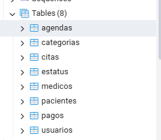
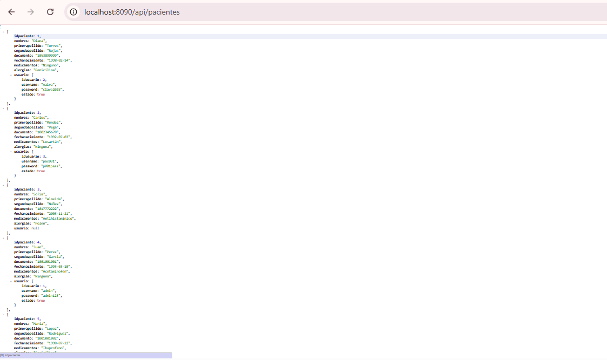
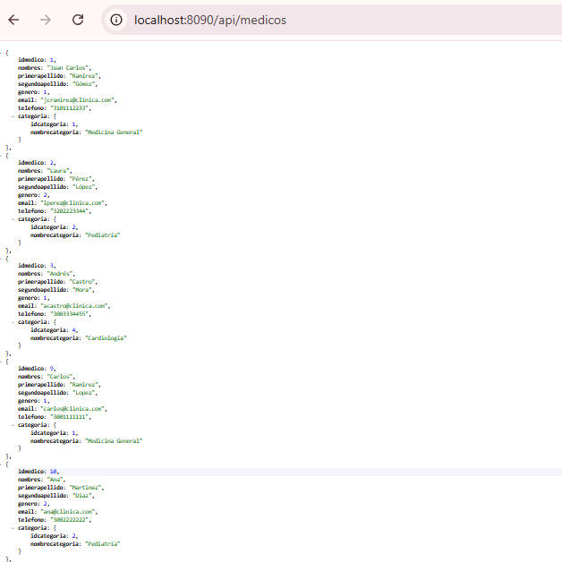
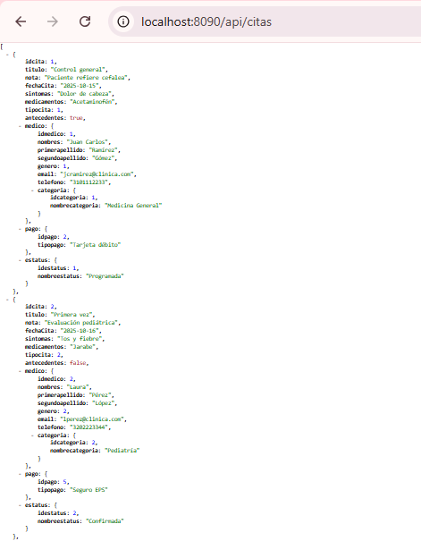
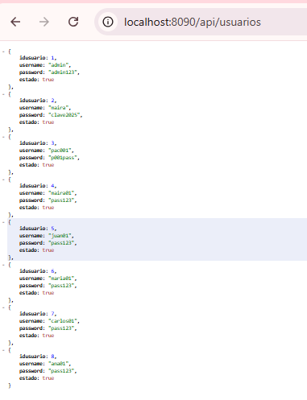
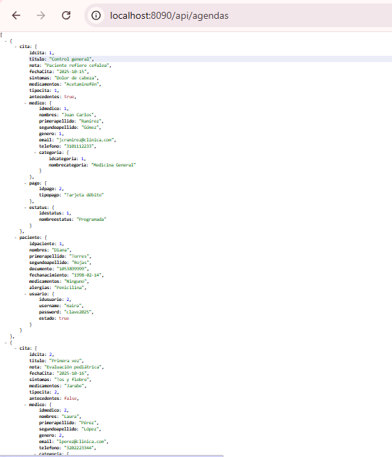
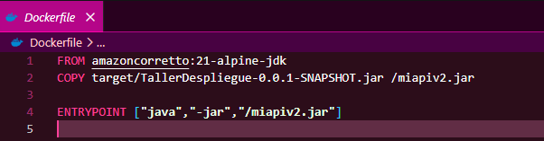

# 🏥 Taller Despliegue Web

Sistema Backend desarrollado con **Spring Boot**, **Spring Data JPA**, **PostgreSQL** y **Docker** para la gestión de pacientes, médicos, usuarios, citas médicas y agendas.

---

# 📖 Descripción

Taller Despliegue Web es una API REST orientada a la administración de información médica.

El proyecto implementa una arquitectura por capas siguiendo buenas prácticas de desarrollo Backend:

* Entidades JPA
* Repositorios Spring Data
* Servicios
* Controladores REST
* Persistencia en PostgreSQL
* Contenerización mediante Docker

La aplicación permite gestionar usuarios, pacientes, médicos, categorías médicas, pagos, estados de citas y agendas médicas.

---

# 🚀 Tecnologías utilizadas

| Tecnología      | Versión |
| --------------- | ------- |
| Java            | 21      |
| Spring Boot     | 3.x     |
| Spring Data JPA | Última  |
| PostgreSQL      | 17      |
| Maven           | 3.9+    |
| Docker          | Sí      |
| Lombok          | Sí      |
| Git             | Sí      |
| GitHub          | Sí      |

---

# 🏗️ Arquitectura

```text
src/main/java/com/jdc/tallerdespliegue
│
├── DTO
├── entity
├── repository
├── rest
├── service
│   ├── interfaces
│   └── implementations
│
└── TallerDespliegueApplication
```

La aplicación sigue una arquitectura multicapa:

* Entity → Modelo de datos
* Repository → Acceso a base de datos
* Service → Lógica de negocio
* Rest → Exposición de endpoints

---

# 🗄️ Modelo de datos

## Usuario

Permite el acceso y gestión de pacientes.

### Campos

* idusuario
* username
* password
* estado

---

## Paciente

Información clínica del paciente.

### Campos

* idpaciente
* nombres
* primerapellido
* segundoapellido
* documento
* fechanacimiento
* medicamentos
* alergias

---

## Médico

Información de profesionales médicos.

### Campos

* idmedico
* nombres
* primerapellido
* segundoapellido
* genero
* email
* telefono

---

## Categoría

Especialidad médica.

### Campos

* idcategoria
* nombrecategoria

Ejemplos:

* Medicina General
* Pediatría
* Cardiología
* Neurología
* Dermatología

---

## Pago

Métodos de pago disponibles.

### Campos

* idpago
* tipopago

Ejemplos:

* Efectivo
* Tarjeta Débito
* Tarjeta Crédito
* Transferencia
* Seguro EPS

---

## Estatus

Estado de una cita médica.

### Campos

* idestatus
* nombreestatus

Ejemplos:

* Programada
* Confirmada
* Finalizada
* Cancelada
* Reagendada

---

## Cita

Registro de consultas médicas.

### Campos

* idcita
* titulo
* nota
* fechaCita
* sintomas
* medicamentos
* tipocita
* antecedentes

Relaciones:

* Médico
* Pago
* Estatus

---

## Agenda

Tabla intermedia que relaciona:

* Paciente
* Cita

Implementada mediante clave compuesta:

```java
AgendaId
```

---

# 📌 Funcionalidades implementadas

## Gestión de Usuarios

* Crear usuario
* Consultar usuario
* Actualizar usuario
* Eliminar usuario

---

## Gestión de Pacientes

* Crear paciente
* Consultar paciente
* Consultar por ID
* Actualizar paciente
* Eliminar paciente

---

## Gestión de Médicos

* Crear médico
* Consultar médico
* Consultar por ID
* Actualizar médico
* Eliminar médico

---

## Gestión de Citas

* Crear cita
* Consultar citas
* Consultar por ID
* Actualizar cita
* Eliminar cita
* Consulta por rango de fechas

---

## Gestión de Agenda

* Asociar paciente a cita
* Consultar agenda
* Eliminar relación agenda

---

# 🔗 Endpoints principales

## Usuarios

```http
GET /api/usuarios
GET /api/usuarios/{id}
POST /api/usuarios
PUT /api/usuarios/{id}
DELETE /api/usuarios/{id}
```

---

## Pacientes

```http
GET /api/pacientes
GET /api/pacientes/{id}
POST /api/pacientes
PUT /api/pacientes/{id}
DELETE /api/pacientes/{id}
```

---

## Médicos

```http
GET /api/medicos
GET /api/medicos/{id}
POST /api/medicos
PUT /api/medicos/{id}
DELETE /api/medicos/{id}
```

---

## Citas

```http
GET /api/citas
GET /api/citas/{id}
POST /api/citas
PUT /api/citas/{id}
DELETE /api/citas/{id}
GET /api/citas/rango
```

---

## Agenda

```http
GET /api/agendas
POST /api/agendas
DELETE /api/agendas
```

---

# 🐳 Docker

Dockerfile utilizado:

```dockerfile
FROM amazoncorretto:21-alpine-jdk

COPY target/TallerDespliegue-0.0.1-SNAPSHOT.jar /miapiv2.jar

ENTRYPOINT ["java","-jar","/miapiv2.jar"]
```

Construcción:

```bash
docker build -t tallerdespliegue .
```

Ejecución:

```bash
docker run -p 8090:8090 tallerdespliegue
```

---

# 📸 Evidencias

## Base de datos PostgreSQL



---

## API Pacientes



---

## API Médicos



---

## API Citas



---

## API Usuarios



---

## API Agenda



---

## Dockerfile



---

# ▶️ Ejecución local

Clonar repositorio:

```bash
git clone https://github.com/Ing-MairaAlejandraRangel/despliegueweb.git
```

Ingresar al proyecto:

```bash
cd despliegueweb
```

Compilar:

```bash
mvn clean install
```

Ejecutar:

```bash
mvn spring-boot:run
```

La API estará disponible en:

```text
http://localhost:8090
```

---

# 👩‍💻 Autora

**Maira Alejandra Rangel Murillo**

Ingeniera de Sistemas

Proyecto académico desarrollado para la asignatura de Despliegue Web utilizando Spring Boot, PostgreSQL y Docker.
